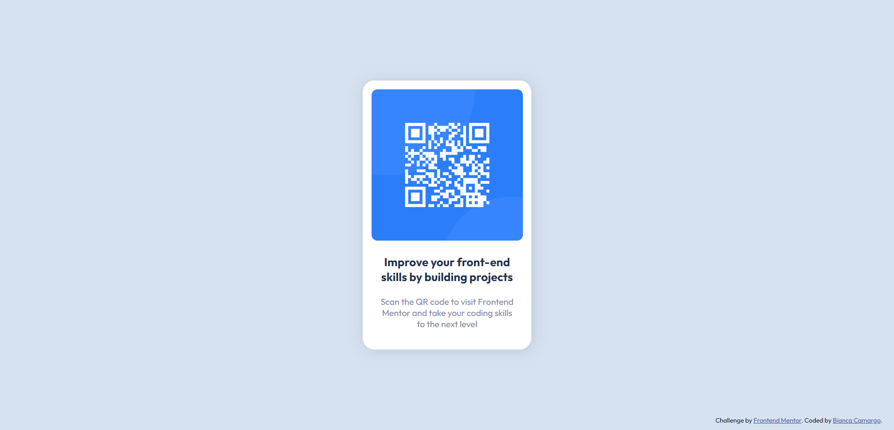

# Frontend Mentor - QR code component solution

This is my solution to my first challenge on Frontend Mentor, the [QR code component challenge](https://www.frontendmentor.io/challenges/qr-code-component-iux_sIO_H)! Although it's a very simple one, I think it was a good (and fun) start to begin exploring what the platform has - and to improve my frontend skills.

## Table of contents

- [Overview](#overview)
  - [Screenshot](#screenshot)
  - [Links](#links)
- [My process](#my-process)
  - [Built with](#built-with)
  - [What I learned](#what-i-learned)
- [Author](#author)
- [Acknowledgments](#acknowledgments)

## Overview

### Screenshot

### Links

- Solution URL: [Solution on Frontend Mentor](https://www.frontendmentor.io/solutions/qr-code-component-gesy1DNGUH)
- Live Site URL: [https://thunderous-sfogliatella-d7ee25.netlify.app/](https://thunderous-sfogliatella-d7ee25.netlify.app/)

## My process

### Built with

- HTML and CSS
- Flexbox

### What I learned

This was my first time uploading and hosting a site on the web! I used [Netlify](https://www.netlify.com/), which made it really easy and simple. 

## Author

- [LinkedIn](https://br.linkedin.com/in/bianca-oliveira-de-camargo-72b885255)